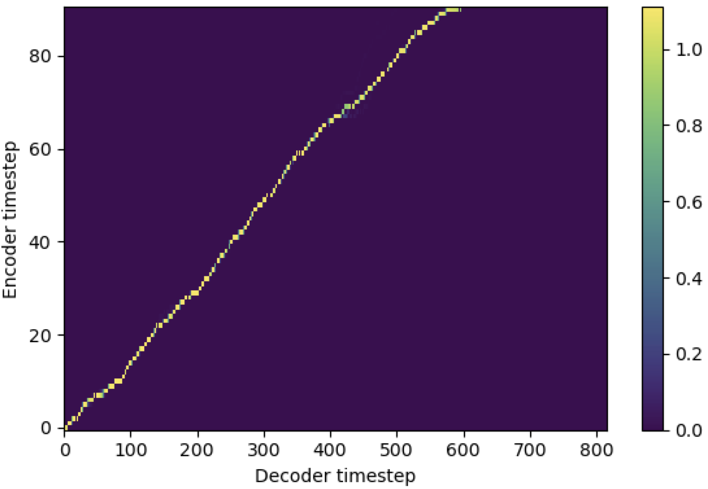

# Stepwise_Monotonic_Multihead_Attention

Pytorch Implementation of Stepwise Monotonic Multihead Attention (SMMA) similar to [Enhancing Monotonicity for Robust Autoregressive Transformer TTS](https://www.isca-speech.org/archive/Interspeech_2020/pdfs/1751.pdf)

## Notes

1. `hp.smma_tunable` is the hyperparameter which can toggle the tunning scheme of stepwise monotonic multihead attention. If set `True`, the stepwise monotonice multihead attention is activated. Else, it is a normal multihead attention just like in Transformer. As in [Enhancing Monotonicity for Robust Autoregressive Transformer TTS](https://www.isca-speech.org/archive/Interspeech_2020/pdfs/1751.pdf)(we will call this paper as 'reference paper' in the following documents), for example, you may train module without SMMA for certain steps to the faster training and model converge, and then activate SMMA by setting `smma_tunable=True` to make strong monotonic alignment in few steps.
2. `expectation()` is the fucntion calculating stepwise monotonic expectation score which is denoted as `alpha` in the reference paper.
3. In the current implementation, the query is from text encoding (output of `encoder` in general TTS framework) and the key and value are from mel-spectrogram encoding (output of `reference encoder` in general mel-spectrogram encoding framework e.g., reference encoder in GST scheme). As a result, current SMMA module converts the mel-spectrogram encoding from the length of mel-spectrogrm to the length of text. You MUST carefully modify the dimension (especially in `expectation` function) of query, key, and value depending on the task.
4. During tunning phase with SMMA, `focused_head` function will select the best diagonal (monotonically increasing) alignment among heads. It follows the ''focus rate' in [FastSpeech](https://arxiv.org/pdf/1905.09263.pdf) framework as in the reference paper.
5. You can enjoy of my code, and any suggestions are appreciated.

## Example Results

As explained above, I used SMMA for matching mel-spectrogram input to text input in time-domain. Belows are some results showing effectiveness of SMMA. The first figure is the alignment without smma (`smma_tunable=False`) at 115k steps. The second figure is the one with smma (`smma_tunable=True`) at 125k steps.

As you can see, I can confirm that the alignment is being highly stronger than normal multihead attention after applying tunning with SMMA.

### References

- [Online and Linear-Time Attention by Enforcing Monotonic Alignments](https://arxiv.org/pdf/1704.00784.pdf)
- [Robust Sequence-to-Sequence Acoustic Modeling with Stepwise Monotonic
  Attention for Neural TTS](https://arxiv.org/pdf/1906.00672.pdf) [[author's code](https://gist.github.com/mutiann/38a7638f75c21479582d7391490df37c)]
- [Monotonic Multihead Attention](https://arxiv.org/pdf/1909.12406.pdf)
- [Enhancing Monotonicity for Robust Autoregressive Transformer TTS](https://www.isca-speech.org/archive/Interspeech_2020/pdfs/1751.pdf)
- [hirofumi0810's implementation](https://github.com/hirofumi0810) of Monotonic (multihead) chunkwise attention
