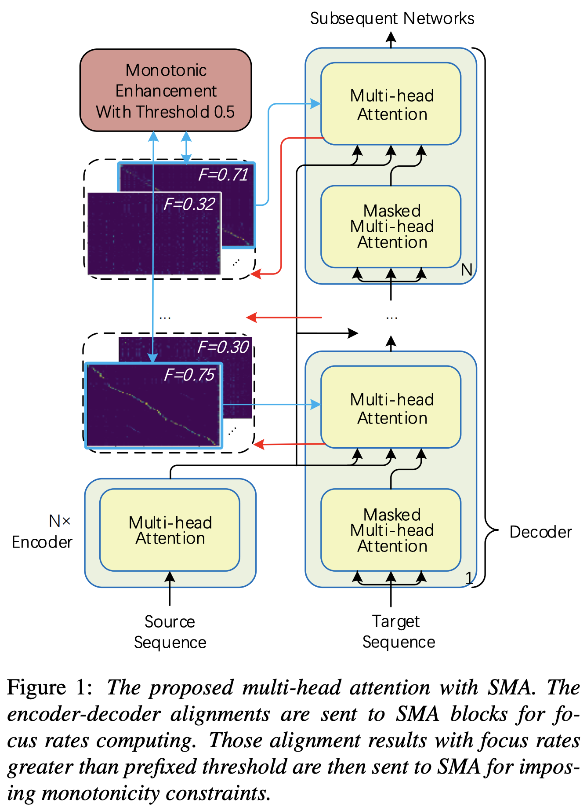
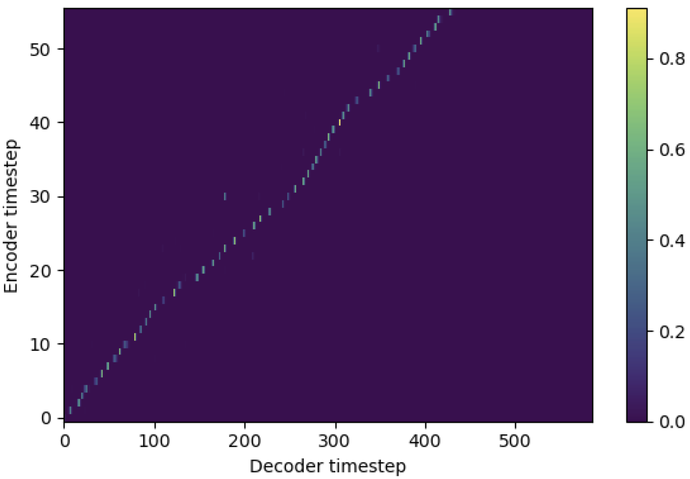

# Stepwise_Monotonic_Multihead_Attention

Pytorch Implementation of Stepwise Monotonic Multihead Attention (SMA) similar to [Enhancing Monotonicity for Robust Autoregressive Transformer TTS](https://www.isca-speech.org/archive/Interspeech_2020/pdfs/1751.pdf)

<p align="center">
    
</p>

# Example Results

You may apply SMA to match mel-spectrogram to text in the length of sequences. Below are some results showing the effectiveness of SMA. The first figure is the alignment without sma (`hp.sma_tunable=False`) at 115k steps. The second figure is the one with sma tunning (`hp.sma_tunable=True`) at 125k steps.

<p align="center">
    
    
</p>

As you can see, I can confirm that the alignment is being highly stronger than normal multihead attention after applying SMA tunning.


# Usage
First, define the SMA. Let's say we have 256 dimensional encoding and 4-multihead attention.
```python
from sma import StepwiseMonotonicMultiheadAttention

ref_attention = StepwiseMonotonicMultiheadAttention(256, 256//4, 256//4)
```
And then, you can apply attention and get an alignment as follows. `mel_len` is the frame size of reference audio, and `seq_len` is the length of input text (which is usually a sequence of phonemes). `fr_max` is a maximum value of focus rate from `focused_head()` function. Both `text_mask` and  `attn_mask` have `1.` for values that will be masked out and `0.` for others to be kept.
```python
"""
enc_out --- [batch, seq_len, 256]
attn --- [batch, seq_len, mel_len] 
enc_text --- [batch, seq_len, 256]
enc_audio --- [batch, mel_len, 256]
text_mask --- [batch, seq_len, 1]
attn_mask --- [batch, seq_len, mel_len]
"""

# Attention
enc_out, attn, fr_max = ref_attention(enc_text, enc_audio, enc_audio,\
                                        mel_len, mask=attn_mask, query_mask=text_mask)
```
As you can see, SMA returns the text-audio fusion in text size (`seq_len`) regardless of the audio size (`mel_len`).

# Notes

1. `hp.sma_tunable` is the hyperparameter that can toggle the tunning scheme of stepwise monotonic multihead attention. If set `True`, the stepwise monotonic multihead attention is activated. Else, it is a normal multihead attention, just like in Transformer. As in [Enhancing Monotonicity for Robust Autoregressive Transformer TTS](https://www.isca-speech.org/archive/Interspeech_2020/pdfs/1751.pdf)(we will call this paper as 'reference paper' in the following documents), for example, you may train module without SMA for certain steps to the faster training and model converge, and then activate SMA by setting `sma_tunable=True` to make strong monotonic alignment in few steps.
2. `expectation()` is the fucntion calculating stepwise monotonic expectation score which is denoted as `alpha` in the reference paper.
3. In the current implementation, the query is from text encoding (output of `encoder` in general TTS framework) and the key and value are from mel-spectrogram encoding (output of `reference encoder` in general mel-spectrogram encoding framework, e.g., reference encoder in GST scheme). As a result, current SMA module converts the mel-spectrogram encoding from the length of mel-spectrogram to the length of text. You MUST carefully modify the dimension (especially in the `expectation` function) of query, key, and value depending on the task.
4. During tunning phase (monotonic enhancement) with SMA, the `focused_head` function will select the best diagonal (monotonically increasing) alignment among heads. It follows the 'focus rate' in [FastSpeech](https://arxiv.org/pdf/1905.09263.pdf) framework as in the reference paper. Different from the reference paper, the maximum focus rated head is selected rather than by threshold. However, you can adopt it by simply adding `prefixed_threshold`(e.g.,`0.5`) to the `focused_head` function.
5. You can enjoy my code, and any suggestions are appreciated.

# Citation

```
@misc{lee2021sma,
  author = {Lee, Keon},
  title = {Stepwise_Monotonic_Multihead_Attention},
  year = {2021},
  publisher = {GitHub},
  journal = {GitHub repository},
  howpublished = {\url{https://github.com/keonlee9420/Stepwise_Monotonic_Multihead_Attention}}
}
```

# References

- [Online and Linear-Time Attention by Enforcing Monotonic Alignments](https://arxiv.org/pdf/1704.00784.pdf)
- [Robust Sequence-to-Sequence Acoustic Modeling with Stepwise Monotonic
  Attention for Neural TTS](https://arxiv.org/pdf/1906.00672.pdf) [[author's code](https://gist.github.com/mutiann/38a7638f75c21479582d7391490df37c)]
- [Monotonic Multihead Attention](https://arxiv.org/pdf/1909.12406.pdf)
- [Enhancing Monotonicity for Robust Autoregressive Transformer TTS](https://www.isca-speech.org/archive/Interspeech_2020/pdfs/1751.pdf)
- [hirofumi0810's implementation](https://github.com/hirofumi0810) of Monotonic (multihead) chunkwise attention
